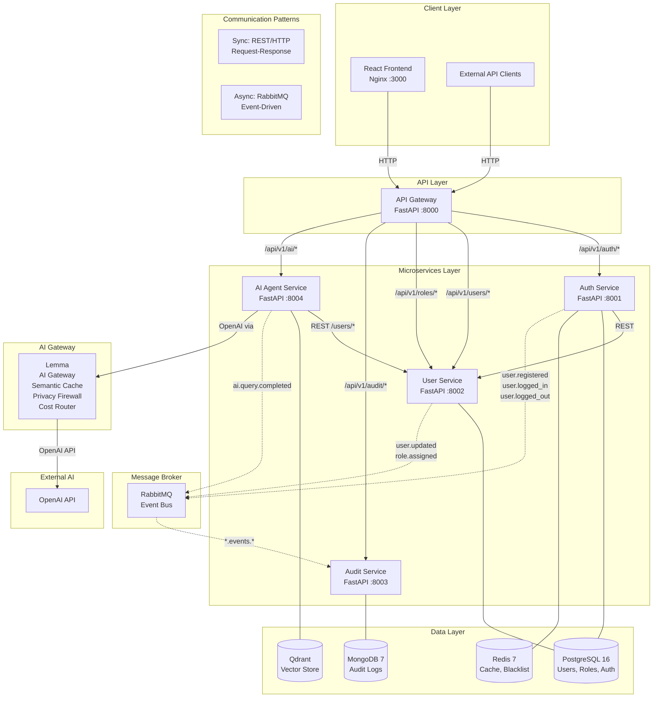

# Toka – Arquitectura del Sistema

## Diagrama de Arquitectura




## Flujo de Datos entre Microservicios

### 1. Registro de Usuario
```
Frontend → POST /auth/register → AuthService (PostgreSQL)
  → publish user.registered event → RabbitMQ
    → UserService consume → create profile
    → AuditService consume → log to MongoDB
```

### 2. Login
```
Frontend → POST /auth/login → AuthService (valida credenciales)
  → genera JWT (access + refresh tokens)
  → publica user.logged_in → RabbitMQ
    → AuditService log en MongoDB
  → Redis: store refresh token
  → respuesta al frontend
```

### 3. Gestión de Usuarios
```
Frontend → GET /users?page=1&size=20 → UserService
  → valida JWT (via middleware o llamada a AuthService)
  → consulta PostgreSQL
  → respuesta paginada
```

### 4. Consulta AI con RAG
```
Frontend → POST /ai/query → AIAgentService
  → 1. Embed query (text-embedding-3-small via Lemma)
  → 2. Search Qdrant (top_k=5, threshold=0.7)
  → 3. Build prompt: system + few-shot + context + query
  → 4. Call OpenAI via Lemma proxy (cache, privacy, routing)
  → 5. Log query to in-memory store
  → 6. Publish ai.query.completed → RabbitMQ → AuditService
  → 7. Return response + metadata (latency, tokens, cost)
```

## Estrategia Multi-DB

| Base de Datos | Tecnología | Caso de Uso |
|---|---|---|
| PostgreSQL 16 | Relacional ACID | Datos transaccionales: usuarios, roles, permisos, relaciones |
| MongoDB 7 | Documental NoSQL | Auditoría: logs de eventos sin esquema fijo, alta velocidad de escritura, TTL indexes |
| Redis 7 | In-memory KV | Cache de tokens, blacklist JWT, rate limiting |
| Qdrant | Vector DB | Búsqueda semántica para RAG, embeddings de documentos |

### Justificación:
- **PostgreSQL**: Necesitamos ACID para datos de usuarios y roles. Las relaciones (user_roles, role_permissions) son inherentemente relacionales. PostgreSQL con schemas separados (auth, users) permite aislamiento lógico dentro de un mismo cluster.
- **MongoDB**: Los logs de auditoría son writes intensivos con esquema variable. MongoDB maneja alta throughput de escritura mejor que PostgreSQL para este tipo de datos. Los TTL indexes permiten expirar logs viejos automáticamente.
- **Redis**: Token blacklist y refresh tokens necesitan acceso sub-milisegundo. La expiración automática de keys (TTL) es perfecta para tokens con tiempo de vida limitado.
- **Qdrant**: Vector database especializada para embeddings. Índice HNSW para búsqueda de similitud en alta dimensionalidad. Necesario para RAG.

## Patrones de Comunicación

### Síncrona (REST/HTTP)
- API Gateway → Microservicios: ruteo por path prefix
- Auth Service → User Service: validación/consulta de usuarios
- AI Agent Service → User Service: obtener datos de usuarios para reportes

### Asíncrona (RabbitMQ)
- **Eventos de dominio**: user.registered, user.logged_in, user.logged_out, user.updated, role.assigned, ai.query.completed
- **Exchange type**: topic (`*.events.*`)
- **Audit Service**: consumer universal (binding key `*.events.*`)
- **User Service**: consumer específico (`user.registered`)

## Resiliencia y Manejo de Fallos

1. **Circuit Breaker**: Implementado en llamadas REST entre servicios (httpx con timeout)
2. **Retry con backoff**: RabbitMQ consumer con retry + dead letter queue
3. **Health Checks**: Docker healthcheck en todos los servicios
4. **Graceful Shutdown**: FastAPI lifespan events para cerrar conexiones limpiamente
5. **Rate Limiting**: Redis-based rate limiting en Auth Service
6. **Fallback**: AI Agent Service retorna respuesta degradada si OpenAI no responde

## Integración de Lemma (AI Gateway)

Lemma actúa como proxy entre AI Agent Service y OpenAI:
- **Semantic Cache**: Respuestas instantáneas para queries similares (ahorro 40-70% tokens)
- **Privacy Firewall**: Filtra secrets, API keys, PII antes de llegar a OpenAI
- **Complexity Router**: Queries simples → modelo barato, queries complejas → premium
- **Dashboard de telemetría**: http://localhost:8082

## Dockerización

Todos los servicios están dockerizados con Docker Compose (11 servicios):

```
postgres, mongodb, redis, rabbitmq, qdrant, lemma,
auth-service, user-service, audit-service,
ai-agent-service, api-gateway, frontend
```

Cada microservicio tiene su Dockerfile (multi-stage para frontend) y las imágenes están optimizadas con Python slim/alpine.
